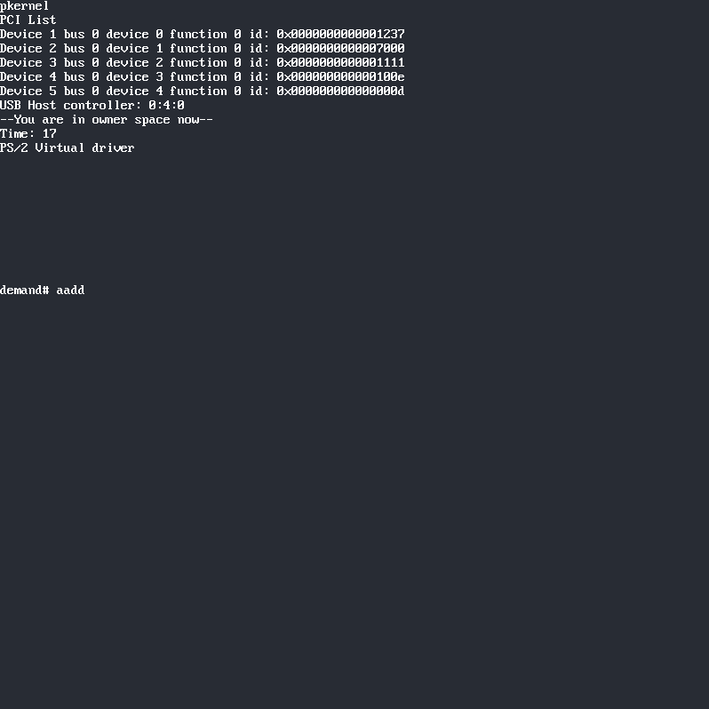

pkernel is a kernel for x86_64

- Print into the framebuffer
- Get PCI list
- PS/2 keyboard for testing in qemu

I'm working in the USB Host controller for get USB Keyboard

# Booting
For booting you need the bootloader
https://github.com/oscar0pavon/pboot  
pboot need to be in virtual_machine like /disk/EFI/BOOT/BOOTX64.EFI, you can soft link too.  
Maybe we can include a git module

# Build
You only need GCC for building. I included the Flat Assembler in ./bin directory
```
make
```
# Run and test
You can test with QEMU, there is a script called "start"
```
./start
```
You can test in real hardware too. Firt you need to install pboot and pkerel in /boot  
Or your EFI partition /boot/efi

# Building method
I use GCC and link script for create a raw binary for loading from EFI memory.

# Programming
You must to use "static" global variables. Linker script not utilize ".bss" section of binaries  
The bootloader managed the framebuffer getting info, so it's passed like an argument to the kernel binary.  
I try to get the C code most simple posible, less code better


