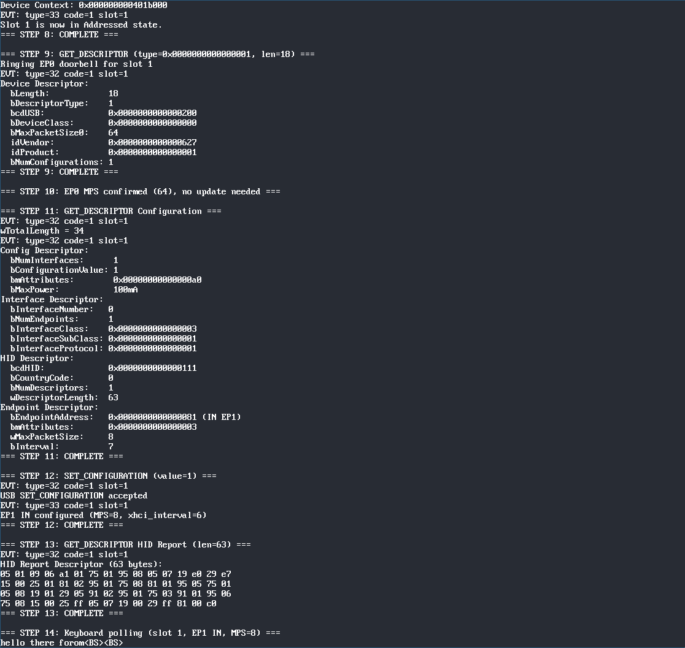

pkernel is a kernel for x86_64, booting on UEFI systems.

### Features
- Print into the framebuffer (`printf`, no libc)
- 16550 serial (COM1) output for early/debug logging
- ACPI: XSDT/MADT/MCFG/FADT parsing, poweroff and reboot
- SMP CPU topology detection (counts CPUs and their APIC IDs)
- GDT, IDT, exception and IRQ handling
- Physical page allocator + `kmalloc`/`kfree` heap
- Paging (identity-maps low memory; maps MMIO regions at runtime)
- LAPIC and LAPIC timer (PM-timer calibrated, 100 Hz)
- Preemptive round-robin multitasking
- PCI / PCIe enumeration (I/O port and ECAM)
- xHCI USB driver with USB keyboard support
- PS/2 keyboard (legacy)
- NVMe driver (read/write, multiple controllers)
- Generic block-device layer
- GPT partition table parsing
- Interactive shell

### Shell commands
`help` `clear` `mem` `uptime` `tasks` `lspci` `nvme` `lsblk` `parts`
`wtest <dev>` `reboot` `poweroff`

### TODO
- Filesystem (FAT32) so files can be loaded from disk
- User space (ring 3) and system calls
- Bring up the other CPU cores (SMP)

# Configure

    ./configure

This clones and builds the pboot bootloader, which is needed for booting
in the virtual machine.

# Build
This only works on GNU/Linux.
You only need GCC for building. The Flat Assembler is included in the
`./tools` directory.

    make -j4

# Run and test
You can test with QEMU using the `run` script:

    ./run

It boots under UEFI with an emulated xHCI keyboard and an NVMe disk
(`virtual_machine/nvme.img`).

You can test on real hardware too. First install pboot and pkernel into
`/boot`, or your EFI partition `/boot/efi`.

# Building method
I use GCC to create a raw flat binary (not ELF), then link everything
together with the linker script (`binary.ld`). The kernel loads at
physical address `0x4000000` (64 MB) and is started from EFI memory.

# Programming
The bootloader gathers the framebuffer info, ACPI tables and memory map,
and passes them to the kernel binary as a single `BootInfo` argument.
I try to keep the C code as simple as possible — less code better.
